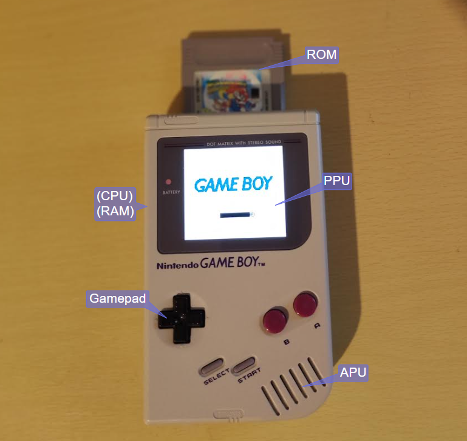
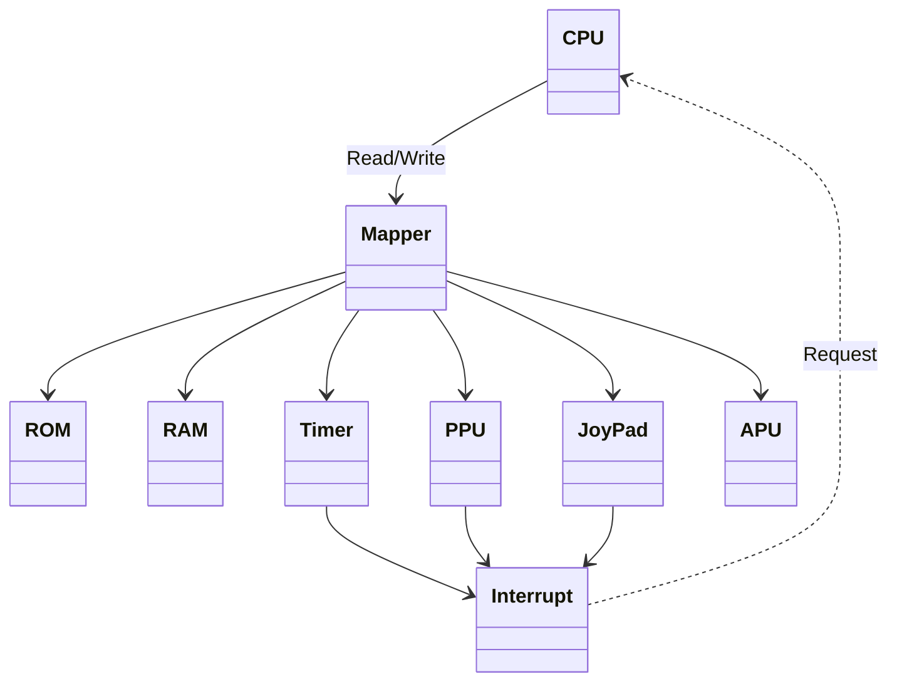
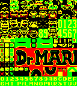
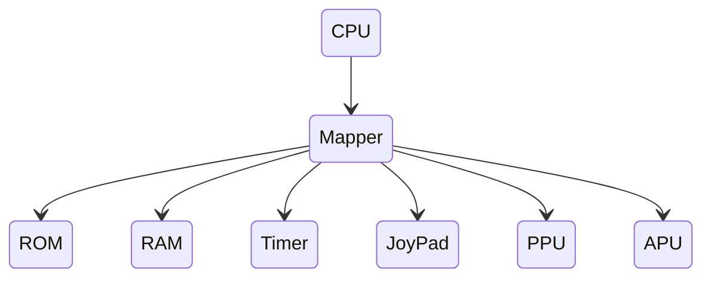
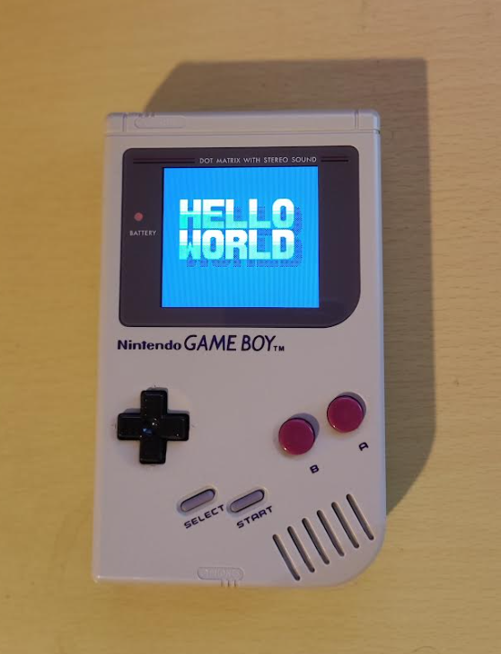
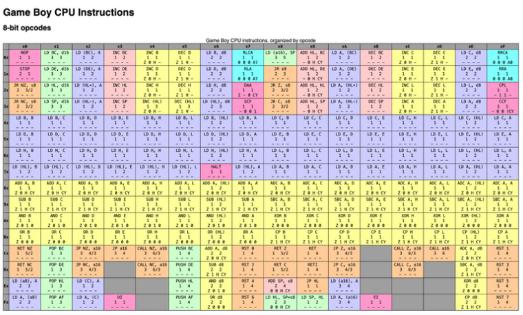
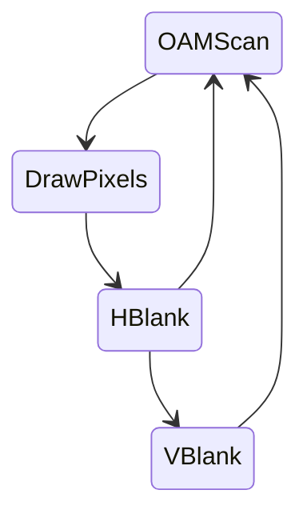

# Emu Boy


Emu Boy is a Game Boy emulator in TypeScript.  This blog details the journey of creating it, and hopefully inspires others to try writing an emulator, as it's a very satisfying experience when it comes together.

It will also list approaches and resources which prove the most useful as we go along.

# Demo

Check out the live demo here https://jacoblister.github.io/emuboy

There are a couple of preloaded images here found freely available on the internet, sourced from this site https://hh.gbdev.io


* It's fairly bare bones at the moment - the browser based sound needs a bit of work
* Try running on a desktop, rather than mobile phone for best results
* Some optimisation still todo, so needs a fairly fast PC for the browser version right now

# Building
See [INSTALL.md](INSTALL.md)

# Introduction and Motiviation

I'm been working on a implementing a compiler recently, and have got it to the point where it can parse a subset of TypeScript useful enough to write real programs.  The compiler currently has backends to generate C/C++ and JavaScript as outputs, and I've got plans to extend this to WebAssembly, x86/64 and ARM, and make it fully self hosted.

It in the mean time, I have been in search of an application to give the compiler a good workout, and writing an emulator seemed like a good fit.

As for chosing a system to emulate, for a number of reasons the Game Boy was a good candiate

* The Game Boy is an extremely widely emulated system - searching 'gameboy emulator' on github returns 2.6 thousand results.  So there are plenty of open source working examples to compare against
* It is extremly well documented, meaning plenty of reference material is available describing every aspect of how the hardware works is available.
* It is a very simple system, without any secondary supporting or legacy chips in it to worry about.
* Console systems of the era often extended functionality by using coprocessors and peripherals in the game cartridges.  Beyond fairly standardised memory bank swiching, Game Boy didn't do this much, meaning a simple emulator should be able to run the majority of software without issues.

# TypeScript

TypeScript is JavaScript with static types

So for example, here's a simple function in JavaScript

```
function add(a, b) {
    return a + b
}
```

And in TypeScript with types:

```
function add(a: i32, b: i32): i32 {
    return a + b
}
```

* TypeScript has many features, but Emu Boy just uses the static typing.  This allows it to be compiled to for example C++, as well as JavaScript
* To compile to JavaScript, the code remains basically the same, but the type definitions are removed.
* Emu Boy largely follows the AssemblyScript TypeScript dialect:
https://www.assemblyscript.org/


# Major Components

The Major Componenets in the project follow the hardware as much as possible.  This mostly worked out pretty well 



# Development Steps

## First Steps & Base Project

The first step was creating a base data structure to hold to major componets of the project.  These mostly follow the Major Components section above, and attempt to limit any cross dependencies as much as possible.




```
class GameBoy {
    interrupt: interrupt.Interrupt
    timer: timer.Timer
    rom: rom.ROM
    ram: ram.RAM
    ppu: ppu.PPU
    apu: apu.APU
    gamepad: gamepad.GamePad
    mapper: mapper.Mapper
    cpu: cpu.CPU
    ...
}
```

The following sections are in roughly the order of implementation, and describe the componenets in more detail.

## ROM and RAM

These trivially easy to implement, and can be represented as simple arrays of numbers.  Test ROM data can be loaded with static initalizer:

```
ROMData: int[] = {0x00, 0x01, ...}
```

Lets move on

## PPU (Round 1)



The very first feature I implemented was a reader for the PPU tile data.  This consisted of about a page of code which could read a copy of video RAM, and write the tile data graphics out to an image buffer.  The format is described here:

https://gbdev.io/pandocs/Tile_Data.html

As a follow up, I implemented the tile map, which allows tiles to be selected to display a full image on the LCD output:


https://gbdev.io/pandocs/Tile_Maps.html

At this point, simple testing of the PPU can be achieved in isolation, as the video RAM is emulated using a simple array of numbers:

```
VRAM: int[]
```

To populate it for testing, the data can be exported for another existing emulator (by modifying it and logging it to the console), then used a static initialized for the VRAM.

This allowed for some rapid early feedback, and gave me some quick confidence that writing a whole emulator would be viable.

## Mapper (Round 1)

The project structure aims to minimise dependencies between the components, by setting up interactions between them mimicing how the hardware works.

On the Game Boy hardware, the CPU accesses the other various componets by presenting a 16 bit address on the address bus, and then reading and writing data to the selected address, which will be connected to various components by decoder logic on the bus.

https://gbdev.io/pandocs/Memory_Map.html

For the emulator, this keeps a clean sepration of the CPU from the other components, and the address bus mapper (and interrupt line - more on that later) are components passed in as dependencies, and the only components the CPU directly interacts with.





| Start | End    | Component | Description                      | 
|-------|--------|-----------|----------------------------------|
|`0000` | `3FFF` | ROM       | 16 KiB ROM bank 00               |
|`4000` | `7FFF` | ROM       | 16 KiB ROM Bank 01~NN            |
|`8000` | `9FFF` | PPU       | 8 KiB Video RAM (VRAM)           |
|`A000` | `BFFF` | RAM       | 8 KiB External RAM               |
|`C000` | `CFFF` | RAM       | 4 KiB Work RAM (WRAM)            |
|`D000` | `DFFF` | RAM       | 4 KiB Work RAM (WRAM)            |
|`E000` | `FDFF` | -         | Mirror of C000~DDFF (Echo RAM)   |
|`FE00` | `FE9F` | PPU       | Object attribute memory (OAM)    |
|`FEA0` | `FEFF` | -         | Not Usable                       |
|`FF00` | `FF7F` | Various   | I/O Registers                    |
|`FF80` | `FFFE` | CPU       | High RAM (HRAM)                  | 
|`FFFF` | `FFFF` | CPU       | Interrupt Enable register (IE)   |


So in code, our mapper looks like this.  It's very similar to the top level project, as it needs to access basically all the components in the system:

```
class Mapper {
    timer: timer.Timer
    rom: rom.ROM
    ram: ram.RAM
    ppu: ppu.PPU
    apu: apu.APU
    gamepad: gamepad.GamePad
    interrupt: interrupt.Interrupt
    ...
}
```

Note that the CPU does not appear here, as other componets can only access it via the interrupt component.

## Hello World! - CPU (Round 1)

Now time to start building the CPU.  The CPU in the Game Boy is a modified Z80 core.  There is a basic description of the CPU Registers/Flags and instruction set in the Game Boy Pan Docs

https://gbdev.io/pandocs/CPU_Registers_and_Flags.html 


### Registers

| 16-bit | Hi  | Lo  | Name/Function           |
|--------|-----|-----|-------------------------|
|`AF`    | `A` | `F` | Accumulator & Flags     |
|`BC`    | `B` | `C` | BC                      |
|`DE`    | `D` | `E` | DE                      |
|`HL`    | `H` | `L` | HL                      |
|`SP`    | `-` | `-` | Stack Pointer           |
|`PC`    | `-` | `-` | Program Counter/Pointer |

### Flags

| Bit | Name | Explanation            |
|-----|------|------------------------|
|`7`  | `Z`  | Zero flag              |
|`6`  | `N`  | Subtraction flag (BCD) |
|`5`  | `H`  | Half Carry flag (BCD)  |
|`4`  | `C`  | Carry flag             |


In realitiy this is not a complete description of how every instruction works, but it's easy enough to look up the instructions in the source code of another working emulator, and follow along with what they do.

CPU Registers are simply stored as numbers:

```
let _B: int = 0
let _C: int = 1
let _D: int = 2
let _E: int = 3
let _H: int = 4
let _L: int = 5
let _F: int = 6
let _A: int = 7
let _HL: int = _F

let FLAG_Z: int = (1 << 7)
let FLAG_N: int = (1 << 6)
let FLAG_H: int = (1 << 5)
let FLAG_C: int = (1 << 4)

class CPU {
    REG: int[]
    SP: int
    PC: int
    ...
}
```

registers are shorted in the REG array, there are 6 of them, plus the stack point SP and program counter PC

Storing the registers as an array makes is easier to write instruction handlers which perform the same operation on different registers, as an index into the array can be used to address the register.

Moving on to some actual Z80 code, a simple hello world example as a real ROM image can be found here:

https://gbdev.io/gb-asm-tutorial/part1/hello_world.html

The source code for this is only about a page long, and it simply copies some predefined data from the ROM image into video RAM memory.

This can, of course, run on the real hardware:



As this simple example only uses about a dozen instructions, implementing each one in the emulated CPU is enough to get it running.

Let's take a simple example - first read the next instruction opcode 

```
let op: int = this.mapper.read(this.PC)
this.PC = (this.PC + 1) & 0xFFFF
```

This reads the next instruction opcode from the ROM via the mapper. Note the mapper could be reading from other areas, depending on the address used.  Code can be executed from RAM for example.

The PC register is masked with 0xFFFF after incremeting it.  This will restrict it's value to a 16 bit range.  In practise correctly written ROMs will never overflow the 16 bit range. 

Next select the instruction to execute from the opcode.  For this purpose, we will use a simple if() {} statement.  More on instruction decoding later.

Lets take a simple example from the test ROM code

```
ld a, 0
```

The instruction handler is:

```
if (op == 0x3E) { // LD a, d8
    this.REG[_A] = this.mapper.read(this.PC)
    this.PC = (this.PC + 1) & 0xFFFF
}
```

Here is the mapper code, as in this example when reading from RAM:

```
read(addr: int): int {
    ...
    if (addr >= 0xC000 && addr < 0xE000) { return this.ram.WRAM[addr - 0xC000] }
}
```

And that's it!  The 8 bit data value is read via the mapper, and stored in the 'A' register.  As with the opcode read the PC program counter register is also incremeted 1 step over that data value just read, ready to read the next instruction.

After implementing the dozen or so instructions the Hello World test ROM needs, the ROM will now run and display its intended output:

## Timer, Interrupt and GamePad components

Now for some more early required components.  These are implemented in a similar fashion to the PPU component in that the CPU does not access them directly but rather can read/write them via the mapper

* The GamePad component handles button press inputs.  This can also generate an interrupt when button presses occur (though very little software uses this feature)
* The timer component can be configured to divide the master clock and increment a counter, and generate a interrupt when the timer overflows.

The interrupt componenet is a little different from the other, in that it is a dependency that is passed into the CPU component directly, rather than through the mapper

```
constructor(interrupt: interrupt.Interrupt, mapper: mapper.Mapper) {
    this.interrupt = interrupt
    this.mapper = mapper
    ...
}
```

This allows external events to tigger the CPU directly, as is the intened purpose of an interrupt.

## CPU (Round 2)

The Hello World example used only about a dozen instructions, but the Z80 core in the Game Boy has about 500+.  There is a comprehensive map of these here:

https://www.pastraiser.com/cpu/gameboy/gameboy_opcodes.html



Filling out this table is one of the most involved tasks of getting an emulator to work correctly, as these need to be 100% correct to get software running.  If there are faults in the implemenation, tracking them down when running game ROMs can very tedious.

Fortunatly there's is a nice tool available to help with this

https://robertheaton.com/gameboy-doctor/

By adding logging of the CPU state and comparing with a known correct implementation, it's fairly easy to see where about in the CPU code the emulation is going wrong.

There are limits though, particaully on instructions which write data, as the logs don't capture this.  These faults tend to show up as unexpected data read later on.

When implementing the full instruction set, there many instruction perform the same action on different registers, so its possible to reduce the amount of duplicated code to take advantage of this.  For example opcode A0-A8 all perform the 'AND' operation on the 'A' registers from another register (or from data read on the address bus).  So the following code can be used for all:

```
let src: int = op & 0x07
let val: int = this.REG[src]
...
let alOp: int = (op >> 3) & 0x07
if (alOp == 4) { // AND A,X
    this.REG[_A] = this.REG[_A] & val
    this.REG[_F] = (this.REG[_A] == 0 ? FLAG_Z : 0) | FLAG_H
}
```

The CPU test suite is very comprehesive, and covers many permutations of the possible combinations.  It can take over an hour to run on real hardware, indicating just many permutations it is testing.

My experience was that once the CPU tests all pass, CPU implementation bugs in practise are not an issue (with the exception of interrupt handling, but that's another story)

# Interrupt Handling

Interrupt handling is required for most software to operation, and is one of the more difficult feature to implement.  The operation of this is described here:

https://gbdev.io/pandocs/Interrupts.html

An interrupt can occur (for example) when a display frame has completed and the PPU enteres the vertical blank phase.  At this point:
* An interrupt frag is raised, and handling is enabled
* The CPU observes this before running its next instruction
* the CPU pushes a return address onto the stack, and jumps to the interrupt handler location
* on completion, the interrupt handler cond returns, and the CPU continues as normal

# PPU (Round 2)

With CPU complete, some ROM will get as far as loading their title screen, but get suck at this point.

This can be due to the fact the the PPU operates as a continuiosuly cycling state machine, as it draws each scanline to the display:

https://gbdev.io/pandocs/pixel_fifo.html



| Line | Phase             |                   |                      |
|------|-------------------|-------------------|----------------------|
|`0`   | `2`OAM Scan       | `3`Drawing Pixels | `0`Horizontal Blank  |
|`1`   | `2`OAM Scan       | `3`Drawing Pixels | `0`Horizontal Blank  |
|`2`   | `2`OAM Scan       | `3`Drawing Pixels | `0`Horizontal Blank  |
|...   |                   |                   |                      |
|`143` | `2`OAM Scan       | `3`Drawing Pixels | `0`Horizontal Blank  |
|`144` | `1`Vertical Blank |                   |                      |
|...   |                   |                   |                      |
|`153` | `1`Vertical Blank |                   |                      |


This needs to be simulated by the emulated PPU, in particular updating the PPU state and raising the Vertical Blank interrupt on completing a frame of video, as most software relies on this.

Other than that, the CPU does not care what the PPU is doing, as it has no to observe its output.

So far, we've only implemented background tiles, but there are three main sections the PPU can display:

* Background - full set of tiles in tile map covering the display area - this can be scrolled around by the PPU SCX, SCY registers from the CPU
* OAM/Sprites - these are objects (such as game characters), which can move around on the display on top of the background later
* Window - this is another overlay of a tile map, often used for static status bar information.

The rules for how these PPU features interact can be quite complicated, and they cannot be verifed by a self hosted test, and the Game Boy is unable to read the actual display output.

Fortunaly, there is a nice small self contained test, which covers most features in a single static image:

https://github.com/mattcurrie/dmg-acid2


Once this is working and displaying correctly, most software will run OK.

# DMA

This is a system feature which allows rapid copying of data from the ROM/RAM of the sytems to Video RAM.  It's main purpose it to quickly load the OAM sprite table from RAM to OAM.

It's restrictive in that it can't do what full traditional DMA can, ie.
* Copy in the background independent of the CPU
* Raise an interrupt on completion.

It is however easy to implement.  Ideally this would be another component module, but as it needs to access the whole address bus, I opted to implement it as a feature of the mapper.

# Tetris!

At this point, simple 32k ROMs like the Tetris, the Game Boy Launch title are playable:

 

  

# APU (Audio)

So far, we've ignored the Audio hardware on the Game Boy and most software will run fine without it.

The Game Boy has some funky audio though.  4 Channels of 4-bit funky lofi goodness.  

The 4 channels on the Game Boy can each be optionally enabled and mixed to either or both the left/right stereo output channels.

All channels except the Wave channel also have a simple envelope generator, which can decay (or raise) the volume after triggering a channel, and optionally cut it off after a timeout.

## Pulse Channel 1 & 2

The pulse channels can produce a tone at a specified pitch (which can be modified after triggering)

The pulse duty cycle can be selected form one of four options:

```
12.5%   |________|
25.0%   |______|-|
50.0%   |____|---|
75.0%   |__|-----|
```

## Wave Channel 3

The Wave channel can load two 16 sample 4 bit custom wave shapes.  It's often used for bass notes.  

As it's a custom waveform it's very flexiable.  With tight timing, it can also be used to steam full audio samples from ROM data.

```
|      ----      |      ----      |
|    --    --    |    --    --    |
|  --        --  |  --        --  |
|--            --|--            --|
```

## Noise Channel 4

The Noise channel uses Linear Feedback Shift Register to generate psudo random noise.  
* The shift rate can be varied to give a more grainy sound
* The shift buffer can be reduced from 15 samples to 7 to give a more period sounding noise

```
+--+--+--+--+--+--+--+--+--+--+--+--+--+--+--+
|15|14|13|13|11|10|09|08|07|06|05|04|03|02|01|
+--+--+--+--+--+--+--+--+--+--+--+--+--+--+--+
  |_______________________.______________|__| (XOR)
                                         
``` 

# Mapper Bank Switching

So far, simple ROM images < 32kb can be loaded directly into the main memory area and are all available to the CPU at once.

For larger ROM images, part address space can be switched to view different section of the ROM at once.

```
+-----------------+     +-----------------+
| 0x0000 - 0x3FFF | --> |                 |
| Fixed           |     +-----------------+
+-----------------+
| 0x4000 - 0x7FFF |     +-----------------+     +-----------------+
| Switched        | --> |                 | ... |                 |
+-----------------+     +-----------------+     +-----------------+
 ```

This is fairly easy to implement in the mapper, and most ROMs run just fine in the simple case.

At this point, the emulator can play some popular titles:

 

  

 

# Compatibilty

After all this, most all of the Game Boy features are complete, and many ROM images started to work.

There's still a bit of debugging to do at the point though as many titles will load to the title screen, but crash on starting the game for example.

I was able to progress very rapildy though this phase now, and just about all ROM images I've been able to test with are working now.

This includes some well known tourture tests, such as the following:

https://eldred.fr/blog/prehistorik/

 

The Audio still isn't quite right though - implementing zombie envelopes for the one title I could found that used them felt like a step too far for me.

# Still Todo

* Save Data
* Save States
* Game Boy Color
* Cartridge features (Real Time Clock etc)

# Testing recap

* Developing a project like this without comprehensive tests in probably not posible
* Fortunatly, plenty of excellent self hosted test cases exist
* Didn't really need unit tests in the end, but there could well be a place for them in similar projects.

# Some Numbers

* 3 Months from starting to simple games working
* Approx 5 Hours per week
* < 2000 lines of code

# Final Thoughts and Tips

* Very satisfying execise I'd recommend to anyone wanting to explore how emulators work
* Some up front planning and componentistion went a long way.  Mostly worked out pretty well.
* Do write dummy handlers for unhandled IO/Memory writes - top source of unhandled bugs and errors
